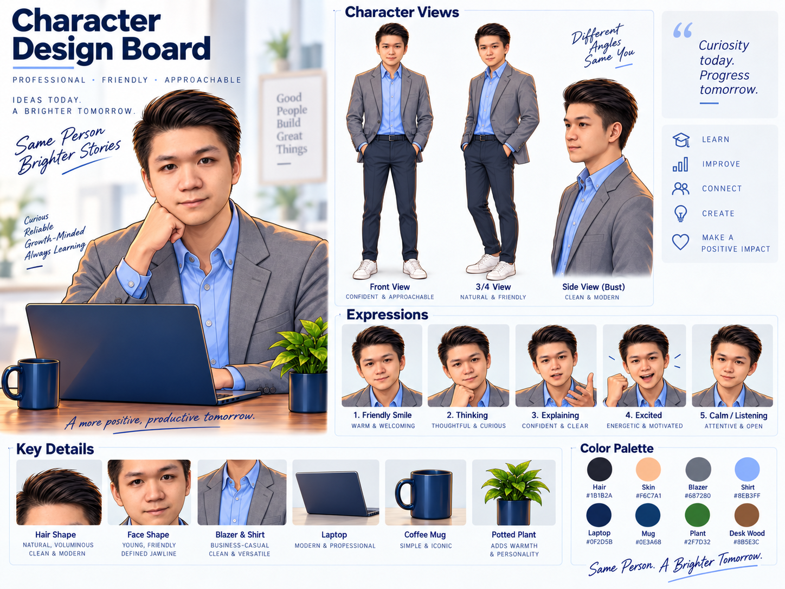
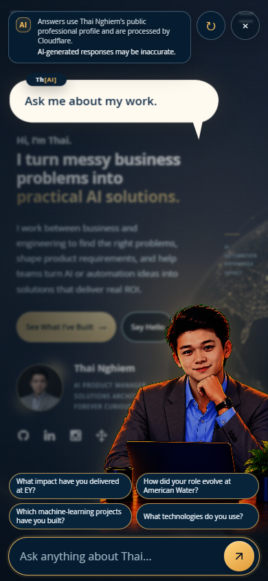

# ExpressiveAI: How I Built Th[AI]

A personal experiment in bringing human identity into an AI experience.

[Visit my portfolio](https://nghiemthai1.github.io/) and open **Ask Th[AI]** to meet the character.

## From a portfolio to a conversation

My portfolio introduces my work, projects, and experience.
I wanted to give visitors another way to get to know the person behind those pages: ask a question and start a conversation.

The character became **Th[AI]**, a small play on my name, Thai.
I call the idea behind the experience **ExpressiveAI**: bringing human personality into an AI interaction through art, expression, and movement.
For me, the bridge between AI and humanity starts with curiosity, a familiar face, and a reason to connect.

## First, a character worth meeting

I used ChatGPT and Gemini to explore concepts, then worked with Codex to bring the character into the website.
The early design board gave those concepts a shared visual direction: professional, friendly, and approachable.

This was the early prototype: a way to explore who the character should be before deciding how the finished experience should feel.

The board explored front, three-quarter, and side views alongside five expressions: a friendly smile, thinking, explaining, excitement, and calm listening.
A gray blazer and blue shirt established the character's appearance.
A laptop, coffee mug, and small plant gave the scene the warmth of an everyday workspace.
The details helped define a personality before I started building the interaction.

"Curiosity today. Progress tomorrow." captured the attitude I wanted to carry forward.
The character needed to feel comfortable welcoming a question, thinking through a response, and listening.

## The detour through 3D

I also tried a rigged 3D character in GLB format.
But the result felt too unfriendly and generic.
I wanted a character who felt approachable and personal, and this version wasn't getting me there.

The illustrated art style gave me more room to express what I had in mind.
A smile, a thoughtful look, or a relaxed pose offered different ways to bring personality into the scene.
I settled on illustration because those expressions mattered to the experience I wanted to create.

That detour gave the project a clearer direction.
I wanted the feeling of sitting across from someone at a desk, comfortable enough to ask a question.
The art style brought me closer to that feeling.

## Finding the character's place

With Codex, I brought the concept into the website.
An image on a design board has one job: communicate a direction.
A character on a portfolio has to share space with everything a visitor came to see.
The face, conversation, and page all needed to feel connected.

The scene became more integrated with the page.
The dark background and gold accents connected the assistant to the rest of the site.
The compact **Ask Th[AI]** launcher gave visitors a clear invitation to begin.

I kept coming back to small gestures.
A resting pose gives the character somewhere to begin.
A shift in attention gives a question a visible response before the words arrive.
Subtle movement helps the illustration feel present while leaving room for the visitor to read.

Then came the less glamorous iterations: moving a speech bubble, adjusting the character's size, refining a button, and checking the result again.
Each adjustment asked the same question: does this feel comfortable to use?
The character's personality depended on those details as much as the original drawing.

## One character, two screens

Opening the experience on a phone brought a different set of decisions.
A composition with plenty of room on a laptop needs more care on a small screen.
I refined the scale and placement while keeping the same illustrated character across both.
I wanted visitors to meet the same Th[AI], wherever they opened the portfolio.

### On a laptop

![Th[AI] in the finished portfolio interface at a 1440 by 900 laptop viewport](assets/images/readme/thai-assistant-laptop.png)

### On a phone

  

These screenshots show the current local build in a browser at laptop and phone viewport sizes.

## A familiar face needs honest answers

The avatar is one part of ExpressiveAI.
The answers need to represent my background responsibly, too.

Giving an assistant my face also meant thinking about the words appearing beside that face.
Th[AI] answers questions from my public professional background, including my work, projects, and education.
I wanted visitors to learn about my experience without mistaking an AI response for a personal promise from me.

The experience identifies Th[AI] as AI and acknowledges the possibility of mistakes.
Questions needing my own judgment belong in a real conversation with me.
That boundary is part of the character's design, too.

## What ExpressiveAI means to me

ChatGPT and Gemini helped me explore the character's direction.
Codex helped turn those ideas into an interactive experience and refine the details across screen sizes.
My role was to choose the personality, shape the experience, and decide what felt right for my portfolio.

That collaboration is the part I want to keep exploring: human intent guiding AI-assisted creation, with something personal and useful at the end.
Th[AI] gives visitors a new way to ask about my work.
ExpressiveAI is the name I give to that meeting of personal expression and AI-assisted creation.

[Meet Th[AI] on my portfolio](https://nghiemthai1.github.io/).
For the implementation details, see the separate [technical guide](DIGITAL_TWIN.md).
